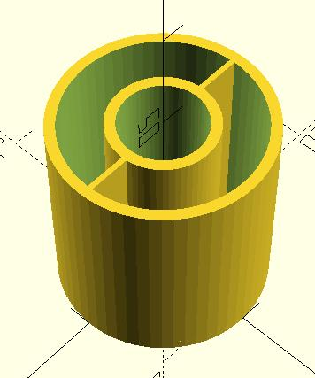

# Saphira
A smart bycicle

# Parts

## Tachometer
Used to precisely measure the rotation of the wheels

#### wheel.scad
creates the slits that the photons of photovoltaic counter pass through and get blocked by

## Gyro
The gyro is used to keep the bike upright. It consistes of a rotor that is filled with sand, a rotor cap, and scaffolding to support the gyro itself and the motor that rotates the gyro.

#### rotorCap.scad

#### rotor.scad

